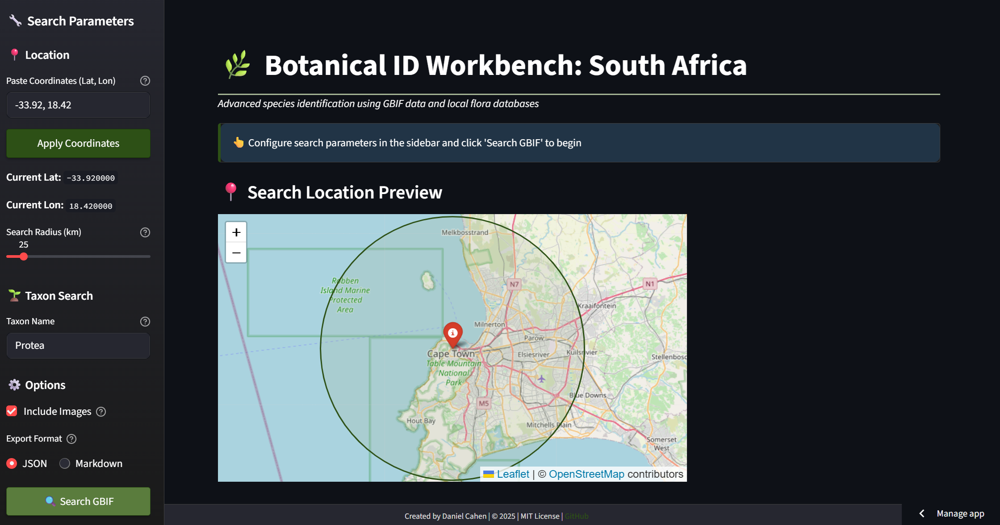

# 🌿 Botanical ID Workbench: South Africa

[](https://streamlit.io)
[](https://www.python.org/)

An advanced web application for botanical species identification in South Africa, leveraging GBIF, iNaturalist, and the official e-Flora database from the South African National Biodiversity Institute (SANBI).



## About The Project

This workbench is designed for botanists, researchers, and serious enthusiasts who need to identify and analyze plant species within a specific geographic area in South Africa. It moves beyond simple identification by providing a suite of tools for data aggregation, visualization, and export, streamlining the research workflow.

The application queries live APIs for the most up-to-date occurrence data and automatically sources its foundational descriptive data from the official e-Flora of South Africa, ensuring a robust and frictionless user experience.

## Key Features

-   **Automated Data Sourcing**: On first launch, the app automatically downloads and processes the complete e-Flora dataset from the official SANBI source. No manual file management required!
-   **Dynamic GBIF Search**: Integrates with the Global Biodiversity Information Facility (GBIF) API to fetch real-time species occurrence data.
-   **Location-Based Filtering**: Search for taxa within a customizable geographic radius around any latitude/longitude point.
-   **Interactive Distribution Mapping**: Visualize species occurrences on an interactive map to understand spatial distribution.
-   **Rich Species Profiles**: Combines detailed morphological descriptions from the e-Flora database with high-quality images from iNaturalist.
-   **Efficient Caching**: Heavy data processing and API calls are cached, ensuring near-instantaneous loads on subsequent runs.
-   **Data Export**: Export your curated species lists and detailed descriptions to JSON (for machine analysis) or Markdown (for reports).

## Getting Started

Follow these steps to get a local copy up and running.

### Prerequisites

-   Python 3.9 or higher
-   `pip` and `venv`

### Installation & Usage

1.  **Clone the repository:**
    ```sh
    git clone https://github.com/your-username/your-repo-name.git
    cd your-repo-name
    ```

2.  **Create and activate a virtual environment (recommended):**
    ```sh
    # For macOS/Linux
    python3 -m venv venv
    source venv/bin/activate

    # For Windows
    python -m venv venv
    .\venv\Scripts\activate
    ```

3.  **Install the required dependencies:**
    ```sh
    pip install -r requirements.txt
    ```

4.  **Run the Streamlit app:**
    ```sh
    streamlit run botanical_app.py
    ```

> **Note:** On the very first run, the application will automatically download and process the e-Flora data (~16MB) from SANBI. This is a one-time setup and may take a moment. Subsequent launches will be immediate.

## Data Handling: The Automated Pipeline

This application's key strength is its automated data pipeline, which addresses a common friction point in data-driven apps.

-   **Source of Truth**: The app fetches the complete e-Flora dataset as a Darwin Core Archive directly from the official [SANBI IPT source](https://ipt.sanbi.org.za/resource?r=flora_descriptions).
-   **Process**: The downloaded ZIP archive is extracted, and the raw text files (`taxon.txt`, `description.txt`, `vernacularname.txt`) are processed and merged into a single, optimized DataFrame.
-   **Caching**: This entire process is wrapped in Streamlit's `@st.cache_data`. The resulting DataFrame is cached in memory, meaning the download and processing happen only once until the cache expires or is manually cleared.

This automated approach ensures that the foundational data is always sourced correctly, removes all manual setup steps for the user, and guarantees high performance during regular use.

## Deployment

This app is designed to run seamlessly on Streamlit Cloud.

-   Include your `requirements.txt` file in the repository.
-   The automated data fetching works perfectly in a deployed environment. Each new cloud instance will perform the one-time data download on its first run, and the app will be fast and responsive thereafter.

---
